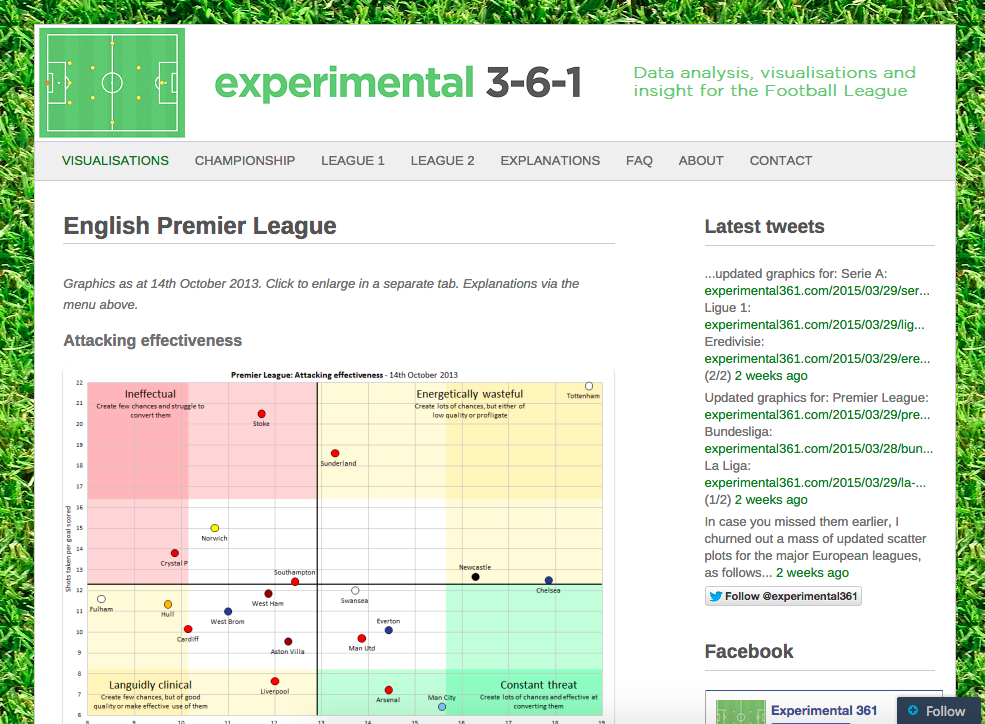

#Datenanalyse mit R

Kürzlich bin ich auf einer News-Website über einen Artikel der Website [experimental 361](http://experimental361.com) gestolpert: 
[English Premier League - Attacking effectiveness, Defense effectiveness](http://experimental361.com/english-premier-league).

Ben Mayhew erklärt anhand von schönen Graphen welche Teams besonders effektiv in der Offensive und Defensive sind.
Effektiv bedeutet in diesem Kontekt aus wenigen Torchancen ein Tor zu erzielen, bzw. dass der Gegener viele Torchancen benötigt um ein Tor zu schiessen.




Dadurch inspiriert wollte ich eine leicht abgeänderte Frage für die Schweizer Fussballliga beantworten:

**Welche Stürmer sind besonders effizient?**

Die [Programmiersprache R](http://www.r-project.org/) eignet sich perfekt um eine solche Aufgabenstellung zu erfüllen.

Die Analyse skizziere ich mir etwa so:

1. Laden der Daten
2. Bereinigung und Transformation der Daten
3. Graphische Darstellung
4. Interpretation

Der gesamten Code dieser Analyse ist auf [Github](https://github.com/andreashermann/football-analysis) öffentlich verfügbar.

## Laden der Daten
Als Datenquelle möchte ich die öffentlich verfügbaren Statistiken der [offiziellen Website](http://www.sfl.ch) der Swiss Football League nutzen.
Für jeden Spieler wird schön aufgeschlüsselt wieviele Minuten er gespielt hat, wieviele Tore er schoss und sogar wieviele Schüsse er abgab.


Leider sind die Daten nicht in perfekt strukturierter Form erhältlich, sondern nur eingebettet in der Website.
Zum Glück bringt R im [Package XML](http://cran.r-project.org/web/packages/XML/index.html) bereits gute Funktionen zum Parsen von HTML mit.

Zuerst lade ich die Website des Teams:
```{r, eval=FALSE}
name <- "fc-zuerich"
url <- paste0("http://www.sfl.ch/superleague/klubs/",name,"/season/201415/")
download.file(url, paste0("teams/",name,".html"))
```

Auf der Website sind alle Spieler aufgelistet und verlinkt.
Diesen Links folge ich und lade die Daten ebenfalls von der Website.
Das Parsen der Spielerdaten sieht dann in etwa so aus:
```{r, eval=FALSE}
# alle Tabellen aus dem HTML-Dokument lesen
tables <- readHTMLTable(document, stringsAsFactors = FALSE, header = FALSE)
# Kombination von 2 Tabellen
player.data <- rbind(tables[[1]], tables[[3]])
```

```{r,echo=FALSE}
source("functions.R")
players <- rbind(
    loadTeam("FC Basel 1893"),
    loadTeam("FC Aarau"),
    loadTeam("FC Zuerich"),
    loadTeam("FC Luzern"),
    loadTeam("FC Sion"),
    loadTeam("FC St. Gallen"),
    loadTeam("FC Thun"),
    loadTeam("FC Vaduz"),
    loadTeam("Grasshopper Club"),
    loadTeam("BSC Young Boys")
  )
```

## Bereinigung und Transformation der Daten

Die Daten sind konsistent. Fehler habe ich keine gefunden.

Dies bedeutet wenig Aufwand um die gewünschten Felder herauszufiltern und die Statistiken zu generieren.

Ich beschränke an dieser Stelle die Analyse auf Spieler welche mindestens drei Tore erzielt haben,
weil das Diagramm am Schluss sonst zu unübersichtlich wird.
```{r}
suppressMessages(library(dplyr))
min.goals <- 3
player.statistics <- players %>%
  filter(goals >= min.goals) %>%
  filter(minutes.played > 0) %>%
  mutate(shots.per.goal = shots/goals) %>%
  mutate(minutes.per.shot = minutes.played/shots) %>%
  mutate(minutes.per.goal = minutes.played/goals) %>%
  mutate(bmi = weight/(height/100)^2) %>%
  arrange(shots.per.goal, goals) %>%
  select(name, goals, shots, minutes.played, team, shots.per.goal, minutes.per.shot, minutes.per.goal)
```

## Graphische Darstellung

Mit der Library [ggplot2](http://ggplot2.org) kann man relativ schnell sehr schöne Graphen erstellen.
Die Feinjustierung benötigt dann aber doch noch einige Zeit.


```{r, echo=TRUE}
library(ggplot2)
library(grid)
ggplot(player.statistics, aes(minutes.per.shot, shots.per.goal)) + 
    ggtitle("Analyse Superleague-Torschützen (>3 Tore)") + 
    labs(x = "Minuten pro Torschuss", y = "Schüsse pro Tor") +
    scale_y_continuous(limits = c(3,11), breaks=seq(2,11,0.5)) + 
    scale_x_continuous(limits = c(25,75), breaks=seq(0, 90, 5))  +
    geom_point(size=4, alpha=1/2, color="steelblue") + 
    geom_text(aes(label=paste0(name," (",goals,")")),hjust=0, vjust=-0.5) + 
    geom_hline(yintercept=5.25, linetype="solid", alpha=0.75) +
    geom_vline(xintercept=46.3, linetype="solid", alpha=0.75) +
    geom_rect(xmin=0, xmax=34.3, ymin=0, ymax=Inf, alpha=0.0025, fill='red') +
    geom_rect(xmin=0, xmax=Inf, ymin=0, ymax=4.0, alpha=0.0025, fill='red') +
    geom_text(label="Viele Chancen", x=24.25, y=11.1, colour = "red", hjust=0, alpha=0.075) + 
    geom_text(label="Effizient", x=73.5, y=2.75, colour = "red", hjust=0, alpha=0.075) + 
    theme(legend.position="none")
```

## Interpretation

Mit dem obigen Befehl wurde bereits ein schönes Diagramm generiert.
Die Interpretation hat bereits in diesem [Blogpost](http://blog.andyhermann.ch/2015/02/superleague-stuermer-statistik.html) stattgefunden.